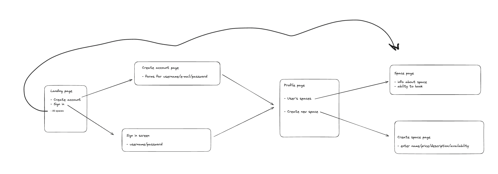

# MakersBnB 

Welcome to our web application! Here, users can effortlessly list their available spaces and book accommodations for the night, akin to popular platforms like Airbnb. As part of the Makers Bootcamp, this project reflects our ongoing journey in web development. Your exploration and contributions are more than welcome in shaping this collaborative effort!

## Tech Stack
For this app we will be using the following tech stack:
- Python
- Flask
- PostgreSQL
- Pytest
- HTML/CSS

## User Stories:

**Anyone can see listings.**
~~~~
As a User
I can go on the main page and see all available spaces
I can go to the login or create new account page.
~~~~
**Users can login and go to their profile page**
~~~~
As a User
So I can see my spaces and bookings
I would like to be able to login and go to my profile page.
~~~~
**Users should be able to create new spaces**
~~~~
As a User
So I can display my spaces
I would like to name, describe, price, add an address and a picture of a new space.
~~~~
**Any signed-up user can request to book any space for one night.**
~~~~
As a User
So I can stay somewhere for a day
I would like to make a request to book a space for one night from the space page
~~~~


## Setup

```shell
# Install dependencies and set up the virtual environment
; pipenv install

# Activate the virtual environment
; pipenv shell

# Install the virtual browser we will use for testing
; playwright install
# If you have problems with the above, contact your coach

# Create a test and development database
; createdb makersbnb
; createdb test_makersbnb

# Open lib/database_connection.py and change the database names
; open lib/database_connection.py

# Run the tests (with extra logging)
; pytest -sv

# Run the app
; python app.py

# Now visit http://localhost:5000/ in your browser
```

## Tests

```
# Run the tests
; pipenv run pytest 
```

## Planning
| |


## Application

|   Description    |   Image    |
|:------------:|:----------------:|
|Main Page| |
|User can sign in| |
|User can create account| |
|User can set their passwords| |
|User can view profile page| |
|User can create new Stay| |
|User can view Stay page| |
|User can create a new Booking| |
|User can view their created Stays and Bookings| |


